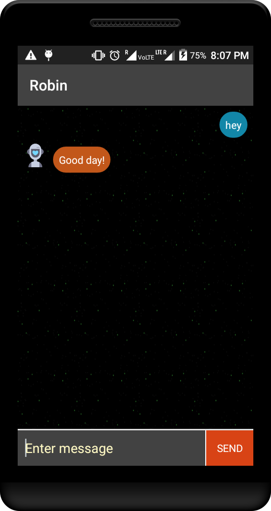
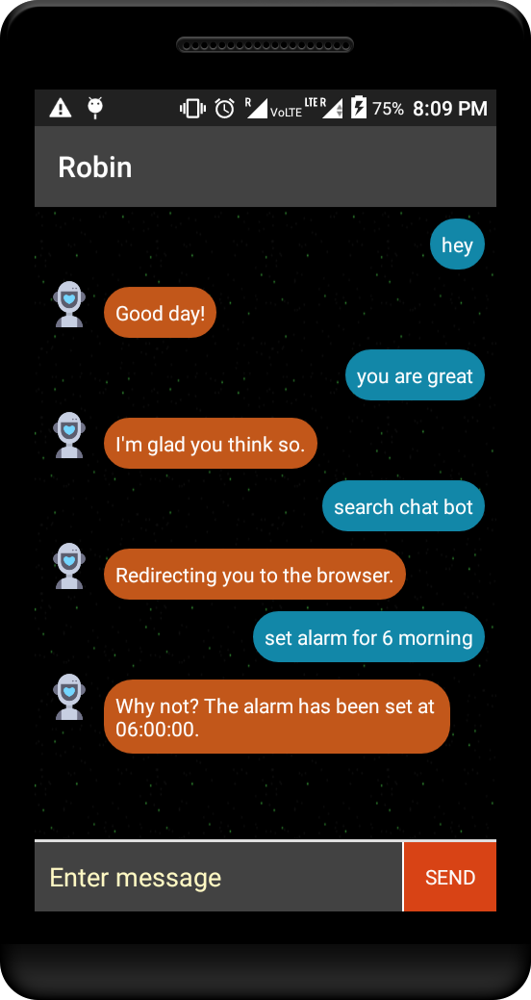

# Robin
A conversation agent in Android.

# Working
This bot has been developed with the help of [DialogFlow](https://dialogflow.com). The bot has been initialised with an
intent which included the capability of small-talk. The further training has been done to to give it the ability to set
alarms, search on Google and other basic operations like opening the system application such as Camera and Gallery.

# Screenshots

</img> </img> </img> 
