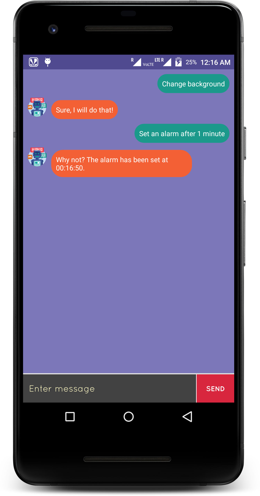
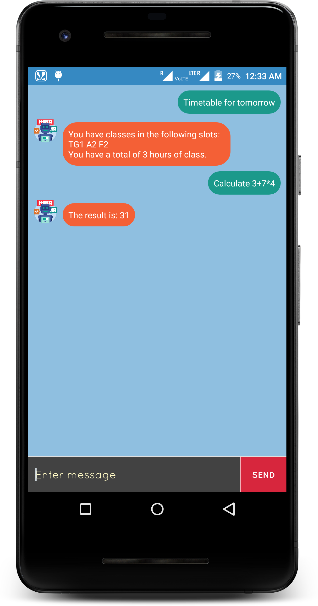

# Robin
A conversation agent in Android.

# Working
This bot has been developed with the help of [DialogFlow](https://dialogflow.com). The bot has been initialised with an
intent which included the capability of small-talk. Further training has been done to to give it the ability to set
alarms, search on Google and other basic operations like opening the system application such as Camera and Gallery.

# Screenshots

</img> </img> </img>

# Walkthrough

</img>

# Functionalities

A comprehensive list of functionalities are:
1. **Look-up** - This function allows the user to look-up certain content on Google search engine. The keyword is: "Search".

2. **TTS** - This stands for Text to Speech. This is used whenever the user interacts with the application. This component is used when the application needs to reply to any of the questions being requested by the user. This function is integrated using the default libraries on the Android platform.

3. **Small-talk** - The conversation agent has the ability to understand some of the general questions and give appropriate answers to each one of them.

4. **Theme-change** - The overall color palette of the application can be changed with the use of keyword: "Change background".

5. **Chat history** - The history of all the conversations between the user and Robin is stored by default and can be cleared with the use of: "Clear history".

6. **Navigate to a place** - This function allows the user to navigate to the location of his choice from his/her current GPS location using Google Maps. The keyword to be used is: "Navigate to".

7. **Open applications** - This function allows the user to open various applications using Robin. The keyword to be used is: "Open [Application name]".

8. **Setup/Check timetable** - After the initial setup of the timetable is completed, this function allows the user to check his/her timetable and classes on any particular day. The keyword to be used is: "Check timetable".

9. **Calculate expressions** - This function can be used for the calculation of expressions on the assistant itself. This function can be used with the keyword: "Calculate 3+4".
